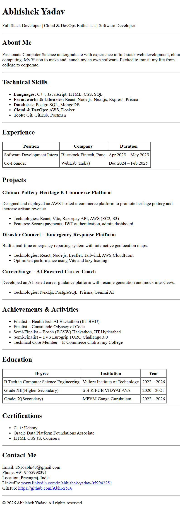

# HTML Resume Page Assignment 📄

This assignment involves creating a **resume using pure HTML only**, without using any CSS or JavaScript. The goal is to understand and apply **basic HTML structure, semantic tags, and clean document organization**.

---
## 🎯 Assignment Objective

* Build a resume webpage using **only HTML**
* Use proper headings, lists, tables, and semantic structure
* Ensure the resume is clean, readable, and submission-ready
* Make it suitable for **ATS and academic evaluation**

---
---

## 🌐 Live Demo

The resume is hosted using **Netlify**.

🔗 **Live Link:**
👉 [Live Link (Netlify)](https://abhishek-html-resume.netlify.app/)

---
## 📸 Resume Preview




## 📂 Folder Structure

```
html-resume-page/
└── index.html
```

---

## 🛠️ Technologies Used

* HTML5

> ❌ No CSS
> ❌ No JavaScript


## ✨ Key Highlights

* Clean and structured HTML document
* Uses semantic tags like `h1`, `h2`, `p`, `ul`, `table`, and `hr`
* Easy to read and print-friendly
* Beginner-friendly and well-organized

---

## 🧪 How to Run Locally

1. Clone the repository or download the folder
2. Open the `index.html` file in any web browser

---

## 👨‍💻 Author

**Abhishek Yadav**
B.Tech Computer Science Engineering
Full Stack Developer | Cloud & DevOps Enthusiast


---

> "Start simple. Build strong." ☕
